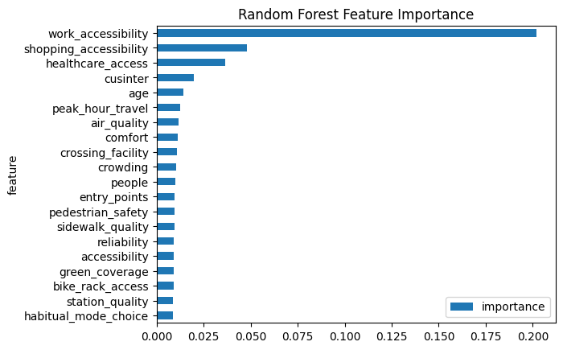
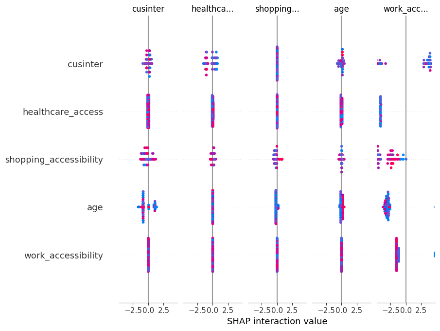
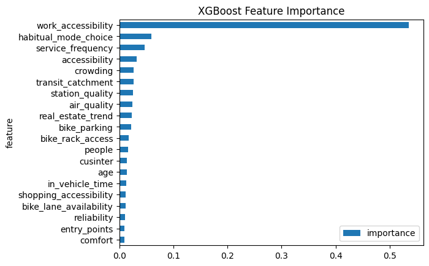

# Travel Mode Choice Prediction Using Random Forest Feature Selection and XGBoost Classification

## 1. Research Overview
This study investigates travel mode choice prediction using machine learning techniques. The objective is to identify the most influential factors affecting transportation mode selection and to develop a robust predictive model with high classification accuracy.

The workflow combines:
- Random Forest feature selection
- XGBoost multi-class classification
- SHAP explainability analysis
- Feature importance interpretation

The dataset contains 305 observations and 105 columns describing travel behavior, accessibility, infrastructure quality, socio-economic attributes, environmental factors, and mobility preferences.

---

## 2. Data Information, Schema and Preprocessing

### Dataset Summary
- Records: 305
- Total Columns: 105
- Identifier Column: `id`
- Target Variable: `travel_mode`
- Predictor Variables: 103 features

### Preprocessing Steps
1. Load CSV dataset.
2. Remove leading/trailing spaces and tab characters from column names.
3. Convert target labels to zero-based indexing:
   - Original classes: 1–5
   - Transformed classes: 0–4
4. Remove:
   - `id`
   - `travel_mode` (target)
5. Train-Test Split:
   - 75% Training
   - 25% Testing
   - Stratified sampling
   - Random state = 42

---

## 3. Feature Selection Process

Random Forest was used to rank features according to their contribution toward classification performance.

### Why Random Forest?
Random Forest is an ensemble learning algorithm that:
- Builds multiple decision trees.
- Aggregates predictions through voting.
- Handles nonlinear relationships.
- Is robust to noise and multicollinearity.
- Provides reliable feature importance scores.

Feature importance was computed using the mean decrease in impurity across all trees.

### Top 30 Selected Features

1. work_accessibility
2. shopping_accessibility
3. healthcare_access
4. cusinter
5. age
6. peak_hour_travel
7. air_quality
8. comfort
9. crossing_facility
10. crowding
11. people
12. entry_points
13. pedestrian_safety
14. sidewalk_quality
15. reliability
16. accessibility
17. green_coverage
18. bike_rack_access
19. station_quality
20. habitual_mode_choice
21. disabled_access
22. multimodal_usage
23. station_spacing
24. real_estate_trend
25. bike_parking
26. commute_duration
27. service_frequency
28. bike_lane_availability
29. transit_catchment
30. in_vehicle_time

---

## 4. Modelling Approach

### XGBoost Classifier

XGBoost (Extreme Gradient Boosting) is a high-performance gradient boosting framework that:
- Builds trees sequentially.
- Corrects previous prediction errors.
- Handles nonlinear feature interactions.
- Includes built-in regularization.
- Provides strong predictive performance.

### Hyperparameters Used

```python
XGBClassifier(
    objective='multi:softprob',
    num_class=5,
    eval_metric='mlogloss',
    random_state=42,
    n_jobs=-1
)
```

### Hyperparameter Interpretation

| Parameter | Purpose |
|------------|----------|
| objective='multi:softprob' | Multi-class probability prediction |
| num_class=5 | Five travel mode classes |
| eval_metric='mlogloss' | Multi-class log loss evaluation |
| random_state=42 | Reproducibility |
| n_jobs=-1 | Parallel processing |

---

## 5. Accuracy Results and Justification for 30 Features

### Feature Count vs Accuracy

| Features | Accuracy |
|-----------|-----------|
| 10 | 88.31% |
| 20 | 88.31% |
| 30 | 90.91% |
| 40 | 89.61% |
| 50 | 88.31% |
| 55 | 90.91% |
| 60 | 90.91% |
| 65 | 90.91% |
| 70 | 90.91% |
| 75 | 90.91% |
| 80 | 89.61% |
| 85 | 90.91% |
| 90 | 90.91% |
| 95 | 90.91% |
| 100 | 89.61% |

### Final Model Accuracy

**XGBoost Accuracy with Top 30 Features = 90.91%**

### Why 30 Features?

The 30-feature configuration provides:
- High predictive accuracy.
- Lower computational complexity.
- Better interpretability.
- Reduced noise from less informative variables.
- Strong balance between performance and model simplicity.

---

## 6. Feature Importance and SHAP Interpretation

### Random Forest Feature Importance

Random Forest importance measures the contribution of each variable to impurity reduction.



Interpretation:
- Work accessibility is the dominant predictor.
- Shopping accessibility and healthcare access are also highly influential.
- Accessibility-related variables dominate mode choice decisions.

### SHAP Importance

SHAP (SHapley Additive exPlanations) quantifies the contribution of each feature to individual predictions.



Interpretation:
- Features near the top exert the greatest influence on predictions.
- Color indicates feature value magnitude.
- Horizontal spread indicates impact strength.
- Positive SHAP values increase likelihood of specific travel mode predictions.
- Negative SHAP values decrease likelihood.

SHAP provides local and global explainability, making model behavior transparent.

### XGBoost Feature Importance



Interpretation:
- XGBoost confirms the importance of accessibility and infrastructure variables.
- The ranking aligns closely with Random Forest results.
- Consistency across methods strengthens confidence in the selected feature set.

---

## 7. Conclusion

The study demonstrates that travel mode choice can be predicted effectively using machine learning.

Key findings:
- Accessibility variables are the strongest predictors.
- Infrastructure quality significantly influences transportation decisions.
- Environmental and socio-demographic attributes contribute additional predictive power.
- A reduced 30-feature model achieves 90.91% accuracy while maintaining interpretability.

The combination of Random Forest feature selection and XGBoost classification provides an effective and explainable modelling framework.

---

## 8. Execution Instructions

### Create Virtual Environment (Python 3.10)

```bash
python3.10 -m venv venv
```

### Activate Environment

Linux / macOS:

```bash
source venv/bin/activate
```

Windows:

```bash
venv\Scripts\activate
```

### Install Dependencies

```bash
pip install -r requirements.txt
```

Suggested requirements:

```text
pandas
numpy
scikit-learn
matplotlib
xgboost
shap
jupyter
notebook
```

### Execute Notebook

```bash
jupyter notebook final_notebook.ipynb
```

Run all cells sequentially.

---

## 9. Research Impact

This research contributes to:
- Sustainable transportation planning.
- Urban mobility analytics.
- Infrastructure investment prioritization.
- Public transit optimization.
- Explainable AI applications in transportation research.

The findings provide actionable insights for policymakers and urban planners by identifying the factors that most strongly influence travel mode selection.

---

## 10. Files of Interest

| File | Description |
|--------|-------------|
| mode_choice_data.csv | Raw dataset |
| Feature_Selection_XGBoost_3_Final_Experiment.ipynb | Feature selection experiments |
| final_notebook.ipynb | Final modelling notebook |
| rf_feature_importance.png | Random Forest feature importance |
| shap_summary.png | SHAP summary visualization |
| xgb_feature_importance.png | XGBoost feature importance |

---

## Reproducibility

- Random Seed: 42
- Train/Test Split: 75/25
- Feature Selection: Random Forest
- Classifier: XGBoost
- Classes: 5
- Final Accuracy: 90.91%
